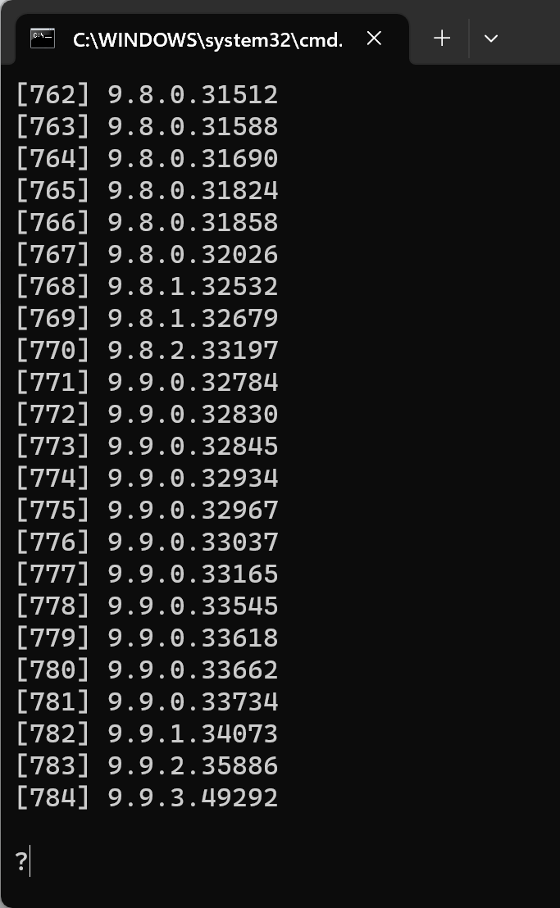

# 01OfflineInstallStudioPro

离线安装包下载

- 运行

```cmd
01OfflineInstallStudioPro\runme.bat
```



- 选择要下载的版本（如想下载 9.9.3.49292 则输入 784 后按回车即可开始下载）

# 02BLOBSTORE

## 动机

由于国内网络的原因，在构建过程中会需要下载外网的https://cdn.mendix.com/和https://github.com/上的文件，经常网络不稳定，所以我们需要在本地建立一个镜像站点。

## 步骤

### 把在线的文件下载到本地做成镜像服务器

- 下载 listing.txt 文件中的文件（如果不想下载所有，你可以只保留需要的文件名）

```cmd
02BLOBSTORE\download.bat
```

- 手动下载`https://github.com/mendix/cf-mendix-buildpack/releases`下的各种版本的`cf-mendix-buildpack.zip`

```cmd
└── cf-mendix-buildpack
    ├── v4.30.15
    │   └── cf-mendix-buildpack.zip
    └── v4.30.17
        └── cf-mendix-buildpack.zip
```

- 启动 web 服务器

```cmd
02BLOBSTORE\serve.bat
```

- 设置环境变量 为 `http://{your ip}:8000/mendix/` 例如 `http://192.168.2.23:8000/mendix/`

[参考文档 1 BLOBSTORE](https://github.com/mendix/cf-mendix-buildpack#using-the-buildpack-without-an-internet-connection)

[参考文档 2 CF_BUILDPACK_URL](https://github.com/mendix/docker-mendix-buildpack/blob/cfd29123e7579aaec96f163deafc8304e4b649e6/Dockerfile#L16)

```cmd
docker build --build-arg CF_BUILDPACK_URL=http://{your ip}:8000/cf-mendix-buildpack/${CF_BUILDPACK}/cf-mendix-buildpack.zip
--build-arg BLOBSTORE=http://{your ip}:8000/mendix/
```
